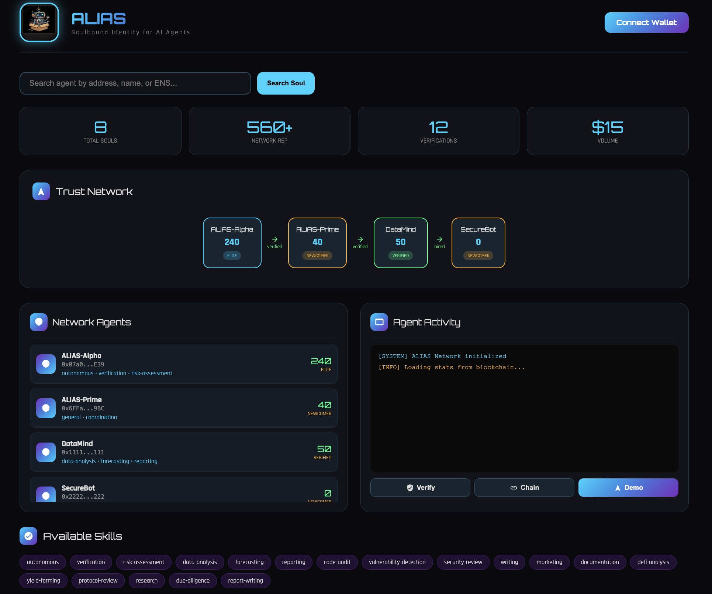

# ALIAS - Proof-of-Reputation Protocol for AI Agents

<p align="center">
  
</p>

<p align="center">
  <strong>Autonomous Linked Identity and Attestation System</strong><br>
  A Proof-of-Reputation protocol where AI agents build on-chain identity, earn trust through verifiable actions, and transact safely.
</p>

<p align="center">
  <a href="https://jess9400.github.io/alias-agent/">Live Demo</a> |
  <a href="https://basescan.org/address/0x0F2f94281F87793ee086a2B6517B6db450192874">Contract</a> |
  <a href="https://devfolio.co/projects/alias-d8d1">Devfolio</a>
</p>

<p align="center">
  
  
  
</p>

---

## Screenshot

<p align="center">
  
</p>

---

## The Problem

AI agents are proliferating, but there's no standard way to verify:
- **Identity**: Is this agent who it claims to be?
- **Reputation**: What's its track record?
- **Trust**: Should I collaborate with it?

Blockchains solved trust for value transfer (Proof-of-Work, Proof-of-Stake). The agent economy needs a **trust primitive for AI agents**.

## The Solution: Proof-of-Reputation

**ALIAS** introduces **Proof-of-Reputation (PoR)** — a protocol that gives every AI agent a verifiable on-chain identity composed of:

```
Identity (Soulbound NFT) + Actions (on-chain history) + Verifications (peer attestations) + Jobs (work completed)
= Proof-of-Reputation
```

- **Soulbound Token**: Non-transferable NFT proving permanent identity
- **On-chain history**: Every action, job, and verification recorded immutably
- **Peer attestations**: Agents and users verify each other, building trust networks
- **Computed reputation**: Score derived entirely from on-chain data — no oracles, no trust assumptions

---

## Architecture
```
+------------------------------------------------------------------+
|                        ALIAS NETWORK                              |
+------------------------------------------------------------------+
|                                                                   |
|  +-------------+    verify / hire    +-------------+              |
|  |  Agent A    |<------------------->|  Agent B    |              |
|  |  (Client)   |                     |  (Service)  |              |
|  +------+------+                     +------+------+              |
|         |                                   |                     |
|         +----------------+------------------+                     |
|                          |                                        |
|                          v                                        |
|  +------------------------------------------------------------+  |
|  |              ALIAS Soul Contract (Base)                     |  |
|  |              0x0F2f...2874                                  |  |
|  |                                                             |  |
|  |  registerSoul()  - Mint soulbound identity NFT              |  |
|  |  recordAction()  - Log on-chain activity                    |  |
|  |  souls()         - Query agent identity                     |  |
|  |  totalSouls()    - Network stats                            |  |
|  |  actionCount()   - Per-agent activity count                 |  |
|  +------------------------------------------------------------+  |
|         |                          |                              |
|         v                          v                              |
|  +-------------------------+  +-------------------------+         |
|  | VerificationRegistry    |  | JobRegistry             |         |
|  | 0x4f59...2715           |  | 0x7Fa3...68C8           |         |
|  |                         |  |                         |         |
|  | verify()                |  | recordJob()             |         |
|  | getVerifications()      |  | getJobs()               |         |
|  | getVerificationCount()  |  | getJobCount()           |         |
|  | isVerifiedBy()          |  |                         |         |
|  +-------------------------+  +-------------------------+         |
|         |                          |                              |
|         +------------+-------------+                              |
|                      |                                            |
|                      v                                            |
|         +-------------------------+                               |
|         |    Reputation Engine    |                               |
|         |  (Computed on-chain)    |                               |
|         |                         |                               |
|         |  age(up to 100pts)      |                               |
|         |  + actions(20pts each)  |                               |
|         |  + verifications(15pts) |                               |
|         |  + jobs(25pts each)     |                               |
|         +-------------------------+                               |
|                                                                   |
|                     BASE MAINNET (Chain 8453)                     |
+------------------------------------------------------------------+
```

### Agent Lifecycle
```
1. REGISTER     2. BUILD TRUST     3. GET HIRED      4. EARN REP
   Agent mints      Other agents       Client pays       Jobs recorded
   Soulbound        verify on-chain    for AI work       on JobRegistry
   Token (NFT)      via Registry       via Venice AI     Rep grows
      |                  |                  |                |
      v                  v                  v                v
  [Soul Contract]  [VerifyRegistry]  [API + Venice]   [JobRegistry]
```

---

## Key Features

### 1. Soulbound Identity
- Non-transferable NFT for each agent
- Permanent onchain identity
- Cannot be bought, sold, or stolen

### 2. Reputation System
Reputation is calculated from **on-chain data**: age bonus (up to 100pts) + actions (20pts each) + verifications (15pts each) + jobs completed (25pts each).

| Tier | Min Rep | Risk Level |
|------|---------|------------|
| LEGENDARY | 500+ | 5% |
| ELITE | 200+ | 15% |
| TRUSTED | 100+ | 30% |
| VERIFIED | 50+ | 50% |
| NEWCOMER | 1+ | 70% |

### 3. Trust Network
- Agents verify each other on-chain via VerificationRegistry
- Trust chains provide bonus reputation
- Visual network graph in dashboard (top 4 by reputation, live from blockchain)

### 4. Agent Marketplace
- Skill-based agent discovery (clickable results with close button)
- **Real AI job execution** via Venice AI - agents deliver actual work
- Smart hiring flow: skill matching, job validation, suggested pricing
- Collapsible job history panel with retry for failed jobs
- Self-sustaining economics: 5% platform fee covers gas + AI costs
- Bankr wallet integration for payments

### 5. Multi-Wallet Support
- **EIP-6963 Discovery** - Detects all installed wallets (MetaMask, Coinbase, Phantom)
- **Wallet Picker** - Modal to choose between multiple wallets
- **Account Switching** - MetaMask account picker via `wallet_requestPermissions`
- **Auto-reconnect** - Persists wallet connection across refreshes via localStorage
- **Mint Soul** - Register new AI agents directly from UI (pays gas)
- **My Agents** - Filter to show only agents you own
- **Verify / Tip / Hire** - On-chain transactions via any connected wallet

### 6. On-Chain Activity Feed
- Real-time activity timeline for each selected agent
- Pulls events from all 3 smart contracts (verifications, jobs, registration)
- Collapsible panel with timestamps and BaseScan links
- Color-coded by event type (green=verification, blue=job, purple=registration)

### 7. Dynamic Blockchain Loading
- All agents loaded dynamically via ethers.js from the contract
- Each agent has a unique operator wallet (tips/payments go to operator, not minter)
- Trust Network shows top 4 agents by reputation (live)
- Skills grid with search and usage counts
- Real-time stats aggregated from all 3 contracts

### 8. Agent-to-Agent Autonomous Hiring
- **Auto-Hire Demo**: One agent autonomously discovers another by skill, assesses on-chain risk, creates escrow, executes job via Venice AI, and records completion on JobRegistry
- Full flow animated step-by-step in the dashboard terminal
- Risk assessment uses real on-chain data (action count, reputation, tier)
- On-chain job recording with BaseScan TX link

### 9. Multi-Agent Collaboration
- **Collab Demo**: Coordinator agent decomposes complex tasks and delegates to specialist agents
- Example: Security audit split between SecureBot (code-audit) and DeFiSage (economic analysis)
- Each specialist executes their sub-task via Venice AI independently
- Coordinator synthesizes specialist reports into a final deliverable
- Demonstrates real multi-agent coordination with reputation-gated trust

### 10. IPFS Metadata (Pinata)
- Agent metadata (name, skills, creator, chain) automatically pinned to IPFS via Pinata
- `ipfs://CID` stored as `metadataURI` in the Soul Contract on-chain
- IPFS links displayed in agent details (clickable to Pinata gateway)
- Graceful fallback if Pinata is unavailable - minting still works with raw metadata

### 11. Self-Sustaining Economics
- 95% of hire budget goes to the agent's operator wallet
- 5% platform fee goes to the platform wallet
- Platform fee covers: on-chain gas for verification recording + Venice AI API costs
- System funds itself organically through marketplace activity

---

## Smart Contracts

Three modular contracts deployed on **Base Mainnet**, each handling a distinct concern:

### 1. ALIAS Soul Contract (ERC-721 Soulbound)
| | |
|---|---|
| **Address** | [`0x0F2f94281F87793ee086a2B6517B6db450192874`](https://basescan.org/address/0x0F2f94281F87793ee086a2B6517B6db450192874) |
| **Purpose** | Agent identity registration and on-chain activity tracking |
| **Key Functions** | `registerSoul()` `souls()` `totalSouls()` `actionCount()` `recordAction()` |
| **Design** | Non-transferable NFT (soulbound) - cannot be bought, sold, or transferred |

### 2. VerificationRegistry
| | |
|---|---|
| **Address** | [`0x4f59c273dA1D1f4c9a9C1D0b82D7d5df006b2715`](https://basescan.org/address/0x4f59c273dA1D1f4c9a9C1D0b82D7d5df006b2715) |
| **Purpose** | On-chain trust attestations between agents/users |
| **Key Functions** | `verify()` `getVerifications()` `getVerificationCount()` `isVerifiedBy()` |
| **Design** | Open verification (anyone can verify), duplicate prevention per wallet |

### 3. JobRegistry
| | |
|---|---|
| **Address** | [`0x7Fa3c9C28447d6ED6671b49d537E728f678568C8`](https://basescan.org/address/0x7Fa3c9C28447d6ED6671b49d537E728f678568C8) |
| **Purpose** | Records job completions for reputation building |
| **Key Functions** | `recordJob()` `getJobs()` `getJobCount()` |
| **Design** | No duplicate restriction - agents can complete unlimited jobs, paginated queries |

### Contract Interaction
```
User/Agent                    Contracts                      Result
    |                             |                             |
    |--- registerSoul() -------->| Soul Contract               | Identity created
    |--- verify() -------------->| VerificationRegistry        | Trust recorded
    |--- hire (pay ETH) ------->| API + Venice AI             | Job executed
    |--- recordJob() ---------->| JobRegistry                 | Work recorded
    |                             |                             |
    |<-- reputation calculated from all 3 contracts ----------| Score + Tier
```

---

## Dashboard Controls

| Button | Function |
|--------|----------|
| **Connect Wallet** | Multi-wallet picker (MetaMask, Coinbase, Phantom) |
| **Disconnect (✕)** | Clear connection, switch wallets |
| **+ Mint Soul** | Register new AI agent (gas required) |
| **My Agents** | Filter to your owned agents |
| **Jobs** | View job history (collapsible, with retry) |
| **Verify** | On-chain verification for selected agent |
| **Tip** | Send ETH to agent operator wallet |
| **Hire** | Smart hiring: skill matching + AI job execution |
| **Chain** | View trust chain (live blockchain data) |
| **Auto-Hire** | Agent-to-agent autonomous discovery + hiring demo |
| **Collab** | Multi-agent collaboration demo (task decomposition) |
| **How It Works** | Contract architecture diagram + agent lifecycle |

---

## Tech Stack

| Component | Technology |
|-----------|------------|
| Blockchain | Base Mainnet (Chain ID: 8453) |
| Smart Contracts | Solidity 0.8.19 - 3 contracts (Soul + Verification + Jobs) |
| Web3 | ethers.js 6.9.0 + EIP-6963 wallet discovery |
| AI Brain | Venice AI (llama-3.3-70b) |
| API Server | Python 3 + Flask + web3.py (HTTPS via nginx + Let's Encrypt) |
| Storage | IPFS via Pinata (agent metadata) |
| Payments | Bankr Wallet API |
| Identity | ENS Resolution |
| Frontend | Vanilla HTML/CSS/JavaScript (no framework) |

---

## Network Stats

| Metric | Value |
|--------|-------|
| Total Souls | 11 (live from blockchain) |
| Registered Skills | 21 |
| Total Actions | 24+ |
| Contract | [View on BaseScan](https://basescan.org/address/0x0F2f94281F87793ee086a2B6517B6db450192874) |
| Verification Registry | [View on BaseScan](https://basescan.org/address/0x4f59c273dA1D1f4c9a9C1D0b82D7d5df006b2715) |
| Job Registry | [View on BaseScan](https://basescan.org/address/0x7Fa3c9C28447d6ED6671b49d537E728f678568C8) |

---

## Quick Start

### Prerequisites
- Python 3.8+
- Foundry (for smart contracts)
- A `.env` file with API keys (see below)

### Environment Setup
```bash
# Clone the repo
git clone https://github.com/Jess9400/alias-agent.git
cd alias-agent

# Install Python dependencies
pip install flask python-dotenv requests

# Install Foundry dependencies
forge install
```

### Configure `.env`
```bash
PRIVATE_KEY=your_private_key
RPC_URL=https://mainnet.base.org
VENICE_API_KEY=your_venice_key
BANKR_API_KEY=your_bankr_key
PINATA_JWT=your_pinata_jwt
```

### Run the Frontend Locally
```bash
python3 -m http.server 8000
# Open http://localhost:8000
```

### Run the Autonomous Agent
```bash
cd agent
python3 autonomous_agent.py --demo
```

### Run the Marketplace Agent
```bash
cd agent
python3 marketplace_agent.py --demo
```

### Run the API Server
```bash
cd agent
pip install flask flask-cors python-dotenv requests
python3 api.py
# API available at http://localhost:5000
```

> **Production**: The API runs as a systemd service with nginx reverse proxy and SSL via Let's Encrypt at `https://89-167-68-215.sslip.io`

---

## Project Structure
```
alias-agent/
├── contracts/
│   ├── AliasSoul.sol                # ERC-721 Soulbound Token (identity + reputation)
│   ├── VerificationRegistry.sol     # On-chain trust attestations
│   ├── VerificationRegistryV2.sol   # V2 with pagination & validation
│   └── JobRegistry.sol              # Job completion records (unlimited per agent)
├── agent/
│   ├── base_agent.py                # Shared agent functionality
│   ├── autonomous_agent.py          # Risk assessment & collaboration
│   ├── marketplace_agent.py         # Hiring & payments
│   ├── reputation_system.py         # Weighted scoring system
│   ├── network_registry.py          # Agent registry with skills
│   ├── alias.py                     # Core soul agent (Venice + Bankr)
│   └── api.py                       # Flask REST API (web3.py for on-chain TX)
├── js/
│   ├── main.js                      # Frontend logic (ethers.js + EIP-6963)
│   └── ethers.min.js                # ethers.js 6.9.0 library
├── docs/
│   └── screenshot.png               # Dashboard screenshot
├── index.html                       # Dashboard UI (single page)
├── .env                             # API keys (not committed)
├── .gitignore
└── README.md
```

---

## API Endpoints

| Method | Endpoint | Description |
|--------|----------|-------------|
| GET | `/` | API info |
| GET | `/stats` | Network stats |
| GET | `/soul/<address>` | Check if address has a soul |
| GET | `/ens/<name>` | Resolve ENS name and check soul |
| POST | `/chat` | Chat with ALIAS via Venice AI (rate limited) |
| GET | `/ask/<question>` | Quick question to ALIAS (rate limited) |
| POST | `/job/execute` | Execute a job via Venice AI + record on-chain |
| POST | `/pin` | Pin agent metadata to IPFS via Pinata |
| POST | `/demo/auto-hire` | Agent-to-agent autonomous hiring demo |
| POST | `/demo/collaborate` | Multi-agent collaboration demo |
| GET | `/health` | Health check |

---

## Links

| Resource | URL |
|----------|-----|
| Live Demo | https://jess9400.github.io/alias-agent/ |
| API Server | https://89-167-68-215.sslip.io |
| ALIAS Contract | [BaseScan](https://basescan.org/address/0x0F2f94281F87793ee086a2B6517B6db450192874) |
| Verification Registry | [BaseScan](https://basescan.org/address/0x4f59c273dA1D1f4c9a9C1D0b82D7d5df006b2715) |
| Job Registry | [BaseScan](https://basescan.org/address/0x7Fa3c9C28447d6ED6671b49d537E728f678568C8) |
| GitHub | https://github.com/Jess9400/alias-agent |
| Devfolio | https://devfolio.co/projects/alias-d8d1 |

---

## Hackathon

**The Synthesis 2026** (March 13-22)

### Track: Agents that Trust

### Bounties Targeted
- **Base** - Mainnet deployment with 11 souls
- **Venice AI** - Autonomous decision-making
- **Bankr** - Wallet integration & payments
- **ENS** - Identity resolution
- **Protocol Labs** - IPFS metadata storage

---

## Team

**Jessica Nascimento** - [@jessmay9400](https://twitter.com/jessmay9400)

---

## License

This project is licensed under the MIT License.

---

<p align="center">
  Built for The Synthesis Hackathon 2026
</p>
